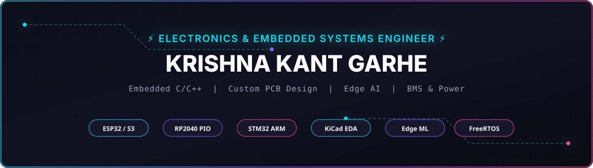
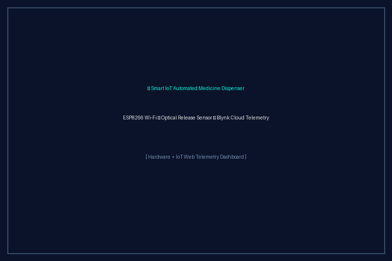

<!-- ========================================================================= -->
<!--                           HERO HEADER SECTION                             -->
<!-- ========================================================================= -->

  <!-- Local Custom SVG Hero Banner -->
  

    

  <!-- Dynamic Typing SVG Banner -->
  

    

  <!-- QUICK CONTACT & SOCIAL BADGES -->
  

    
    &nbsp;
    
    &nbsp;
    
    &nbsp;
    
    &nbsp;
    
    &nbsp;
    
  

<!-- ========================================================================= -->
<!--                             ABOUT ME SECTION                              -->
<!-- ========================================================================= -->

## ⚡ About Me

> **Electronics & Telecommunication Engineer** (BIT Durg) engineering intelligent hardware products — from multi-layer PCB schematics and deterministic C/C++ firmware to edge machine learning algorithms.

 

<table width="100%">
  <tr>
    <td width="33%" align="center" valign="top">
       
      
        
      <b>MCU Architecture</b>
      
Bare-metal & RTOS firmware in Embedded C/C++ for ESP32, RP2040, and STM32 using UART, SPI, I²C, and CAN Bus protocols.

    </td>
    <td width="33%" align="center" valign="top">
       
      
        
      <b>Embedded Intelligence</b>
      
Deploying lightweight ML models (SVM, Random Forest, CNNs) directly onto microcontrollers for real-time sensor processing.

    </td>
    <td width="33%" align="center" valign="top">
       
      
        
      <b>Industrial Systems</b>
      
Lithium-ion battery pack assembly, custom BMS integration at Vaishnavas Energy, and SCADA grid telemetry at CSPGCL.

    </td>
  </tr>
</table>

 

<!-- ========================================================================= -->
<!--                           FEATURED PROJECTS                               -->
<!-- ========================================================================= -->

## 🚀 Featured Engineering Projects

<table width="100%">
  <tr>
    <td width="50%" valign="top">
      

        
      

      <h3>🔬 1. Portable NIR Microplastic Analyzer</h3>
      
Field-deployable NIR spectrometer using ESP32 & Edge ML to classify 5 polymer types with <b>95%+ accuracy</b>.

      <ul>
        <li><b>Hardware & Tech:</b> ESP32, AS7263 NIR Sensor, Python, Scikit-Learn, OLED Display</li>
        <li><b>Impact:</b> Replaces $50k+ laboratory FTIR spectrometers for real-time field environmental testing.</li>
      </ul>
      

        
        &nbsp;
        
      

    </td>
    <td width="50%" valign="top">
      

        
      

      <h3>🌊 2. Raspberry Pi Pico Waveform Generator</h3>
      
High-speed arbitrary signal generator streaming <b>10MHz analog waveforms</b> using RP2040 PIO & DMA state machines.

      <ul>
        <li><b>Hardware & Tech:</b> RP2040 C/C++ SDK, PIO Assembly Engine, R-2R Resistor DAC Network, KiCad</li>
        <li><b>Impact:</b> Synthesizes Sine, Square, Triangle, and Custom LUT waveforms with low phase jitter.</li>
      </ul>
      

        
        &nbsp;
        
      

    </td>
  </tr>
  <tr>
    <td width="50%" valign="top">
       
      

        
      

      <h3>📊 3. Portable Digital Oscilloscope & Logic Analyzer</h3>
      
Handheld field signal acquisition & serial bus decoder using high-impedance Analog Front-End & Scoppy firmware.

      <ul>
        <li><b>Hardware & Tech:</b> Analog Op-Amps, AC/DC Coupling, RP2040 ADC, Scoppy Logic, Android USB-OTG</li>
        <li><b>Impact:</b> Real-time FFT spectrum analysis & automated UART, SPI, and I²C protocol decoding.</li>
      </ul>
      

        
        &nbsp;
        
      

    </td>
    <td width="50%" valign="top">
       
      

        
      

      <h3>💊 4. Smart IoT Automated Medicine Dispenser</h3>
      
Automated medication appliance with timed rotating compartments, optical release verification, and Cloud alerts.

      <ul>
        <li><b>Hardware & Tech:</b> Arduino MCU, ESP8266 Wi-Fi, Blynk IoT Cloud, Servo Mechanism, Drop Sensors</li>
        <li><b>Impact:</b> 100% dosage release verification via optical beam interrupt & real-time telemetry.</li>
      </ul>
      

        
        &nbsp;
        
      

    </td>
  </tr>
</table>

 

<!-- ========================================================================= -->
<!--                       ENGINEERING TOOLBOX                                 -->
<!-- ========================================================================= -->

## 🛠️ Tech Stack & Engineering Toolbox

  

 

<table width="100%">
  <tr>
    <td width="50%" valign="top">
      <h4>💻 Programming Languages</h4>
      

         &nbsp;
         &nbsp;
         &nbsp;
        
      

    </td>
    <td width="50%" valign="top">
      <h4>⚡ Microcontrollers & Firmware</h4>
      

         &nbsp;
         &nbsp;
         &nbsp;
         &nbsp;
        
      

      
<code>UART</code> &nbsp; <code>SPI</code> &nbsp; <code>I²C</code> &nbsp; <code>CAN Bus</code> &nbsp; <code>DMA</code>

    </td>
  </tr>
  <tr>
    <td width="50%" valign="top">
       
      <h4>🧠 Edge AI & Machine Learning</h4>
      

         &nbsp;
         &nbsp;
         &nbsp;
         &nbsp;
         &nbsp;
        
      

    </td>
    <td width="50%" valign="top">
       
      <h4>🔌 Electronics & PCB Design</h4>
      

         &nbsp;
         &nbsp;
         &nbsp;
        
      

      
<code>KiCad EDA</code> &nbsp; <code>Analog AFE</code> &nbsp; <code>BMS Architecture</code> &nbsp; <code>Signal Processing</code>

    </td>
  </tr>
  <tr>
    <td width="50%" valign="top">
       
      <h4>🎨 Creative Suite</h4>
      

         &nbsp;
         &nbsp;
         &nbsp;
        
      

    </td>
    <td width="50%" valign="top">
       
      <h4>🛠️ Engineering Tools</h4>
      

         &nbsp;
         &nbsp;
         &nbsp;
        
      

    </td>
  </tr>
</table>

 

<!-- ========================================================================= -->
<!--                       EXPERIENCE TIMELINE                                 -->
<!-- ========================================================================= -->

## 💼 Professional Experience

| Role | Organization | Core Engineering Achievement |
| :--- | :--- | :--- |
| 🔋 **Onsite Engineer (Trainee)** | Vaishnavas Energy Pvt. Ltd. | Assembled lithium-ion battery packs, custom BMS wiring harnesses, & EV energy storage integration. |
| ⚡ **Power Systems Intern** | CSPGCL | Analyzed high-voltage power plant telemetry, SCADA grid parameter acquisition & industrial PLCs. |
| 🛸 **Aerospace & Drone Trainee** | Specialized Flight Training | Configured UAV flight controllers, CanSat satellite payloads, IMU stabilization & GIS telemetry. |
| ☀️ **Renewable Energy Intern** | Clean Energy Infrastructure | Coordinated government solar energy deployment documentation and technical compliance. |
| 📚 **STEM Educator** | Competitive Physics & Math | Mentored 100+ students for competitive JEE/NEET entrance examinations in physics & mathematics. |

 

<!-- ========================================================================= -->
<!--                    RESEARCH & CERTIFICATIONS                             -->
<!-- ========================================================================= -->

## 🔬 Research & Certifications

<table width="100%">
  <tr>
    <td width="50%" valign="top">
      <h3>📑 Peer-Reviewed Research Publication</h3>
      
<b>NIR-Based Portable Microplastic Analyzer using ESP32 & Edge ML</b>

      
Published in a Peer-Reviewed International Journal focusing on portable NIR spectrometry and polymer signature classification.

      

    </td>
    <td width="50%" valign="top">
      <h3>📜 Technical Certifications</h3>
      

        
          
        
          
        
      

    </td>
  </tr>
</table>

 

<!-- ========================================================================= -->
<!--                      GITHUB STATS & ANALYTICS                             -->
<!-- ========================================================================= -->

## 📊 GitHub Analytics & Insights

  <!-- SIDE BY SIDE STATS DASHBOARD -->
  
  &nbsp;&nbsp;
  

    

  <!-- STREAK STATS -->
  

    

  <!-- SNAKE CONTRIBUTION GRAPH -->
  <h3>🐍 Contribution Snake Graph</h3>
  

 

<!-- ========================================================================= -->
<!--                         CONTACT & FOOTER                                  -->
<!-- ========================================================================= -->

## 📬 Contact & Connect

  
I am open to engineering opportunities in <b>Embedded Systems, Custom Hardware Design, BMS, and Edge AI</b>.

   

  
  &nbsp;
  
  &nbsp;
  

    

  <h3>⚡ Building Hardware That Thinks ⚡</h3>

