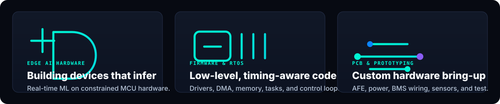
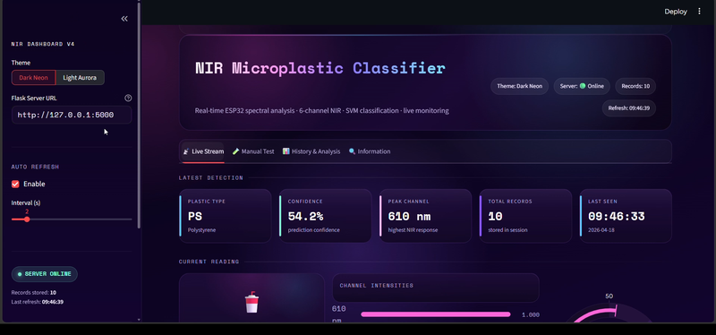
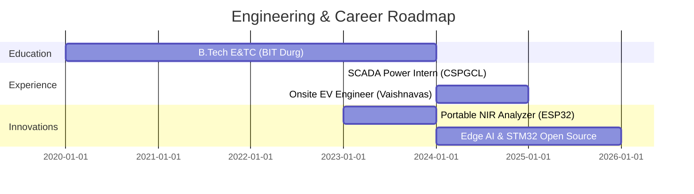

<!-- ========================================================================= -->
<!--                           HERO HEADER SECTION                             -->
<!-- ========================================================================= -->

 

 

 

 

<!-- ========================================================================= -->
<!--                             ABOUT ME SECTION                              -->
<!-- ========================================================================= -->

## ⚡ About Me

> **I build real hardware, write firmware, apply AI, design electronics, and turn prototypes into usable products.**

I am an **Electronics & Telecommunication Engineering graduate from BIT Durg** focused on **intelligent physical systems**. My work connects low-level microcontroller firmware, custom circuit design, and deployable edge AI into practical hardware products.

| Engineering Signal | What I Bring |
| --- | --- |
| 🎓 **Electronics Engineering** | Circuit design, signal processing, telecom fundamentals, and embedded measurement systems. |
| ⚡ **Embedded Firmware** | Low-latency C/C++ firmware for ESP32, RP2040, STM32, peripheral drivers, and real-time control. |
| 🧠 **AI / Machine Learning** | Lightweight ML pipelines using SVM, Random Forest, CNNs, and embedded sensor data. |
| 🔌 **PCB & Product Design** | KiCad, Proteus, analog front-ends, sensor interfaces, power regulation, and hardware bring-up. |
| 🔋 **Clean Energy Experience** | Lithium-ion battery assembly, BMS wiring, EV integration at **Vaishnavas Energy**, and SCADA exposure at **CSPGCL**. |

 

<!-- ========================================================================= -->
<!--                          CURRENT FOCUS SECTION                            -->
<!-- ========================================================================= -->

## 🎯 Current Focus

  

 

<!-- ========================================================================= -->
<!--                            TECH STACK GRID                                -->
<!-- ========================================================================= -->

## 🛠️ Technical Skill Matrix

  

 

<b>Readable Technology Index</b>

 

| Category | Technologies |
| --- | --- |
| **Programming** | C, Embedded C, C++, Python, MATLAB, Git, GitHub |
| **Embedded** | ESP32, Arduino, Raspberry Pi Pico, STM32, FreeRTOS |
| **Protocols** | UART, SPI, I²C, CAN Bus |
| **AI** | Scikit-Learn, TensorFlow, PyTorch, OpenCV, Pandas, NumPy, Matplotlib |
| **Electronics** | KiCad, Proteus, Oscilloscope, Logic Analyzer, Power Electronics, BMS Systems, Circuit Design |
| **Creative** | Adobe Photoshop, Illustrator, Premiere Pro, Lightroom |
| **Development** | VS Code, Arduino IDE, PlatformIO, GitHub Actions |

 

<!-- ========================================================================= -->
<!--                           FEATURED PROJECTS                               -->
<!-- ========================================================================= -->

## 🚀 Featured Projects

<table width="100%">
  <tr>
    <td width="50%" valign="top">
      <h3>🔬 Portable NIR Microplastic Analyzer</h3>
      
<b>Portable AI-powered environmental sensing device</b> for near-infrared polymer classification in field conditions.

      

        <code>ESP32</code> <code>AS7263</code> <code>NIR</code> <code>Edge ML</code> <code>IoT Dashboard</code>
      

      <ul>
        <li><b>Hardware:</b> ESP32 MCU, AS7263 spectral sensor, custom optical chamber.</li>
        <li><b>ML Pipeline:</b> SVM, Random Forest, and CNN experiments in Python.</li>
        <li><b>Performance:</b> 95%+ classification accuracy across five polymer classes.</li>
        <li><b>Interface:</b> Local OLED feedback with real-time IoT monitoring.</li>
      </ul>
      

        
         <i>Real prototype hardware</i>
      

    </td>
    <td width="50%" valign="top">
      <h3>🌊 Raspberry Pi Pico Waveform Generator</h3>
      
<b>High-speed arbitrary signal generator</b> using RP2040 PIO, DMA, and a precision R-2R DAC topology.

      

        <code>RP2040</code> <code>PIO</code> <code>DMA</code> <code>R-2R DAC</code> <code>Signal Gen</code>
      

      <ul>
        <li><b>Core Engine:</b> Dual-core RP2040 with direct memory access.</li>
        <li><b>Output:</b> Sine, square, triangle, sawtooth, and arbitrary LUTs.</li>
        <li><b>Control:</b> LCD-driven frequency and amplitude interface.</li>
        <li><b>Goal:</b> Compact lab-grade waveform generation for prototyping.</li>
      </ul>
      

        
         <i>Real prototype hardware</i>
      

    </td>
  </tr>
  <tr>
    <td width="50%" valign="top">
      <h3>📊 Portable Digital Oscilloscope</h3>
      
<b>Compact acquisition and diagnostics tool</b> for signal analysis, serial decoding, and field troubleshooting.

      

        <code>AFE</code> <code>Scoppy</code> <code>FFT</code> <code>UART</code> <code>SPI</code> <code>I²C</code>
      

      <ul>
        <li><b>Analog Front-End:</b> Input protection, attenuation, AC/DC coupling.</li>
        <li><b>Signal Analysis:</b> FFT spectrum view and voltage measurement.</li>
        <li><b>Protocol Decoding:</b> UART, SPI, and I²C signal inspection.</li>
        <li><b>Form Factor:</b> Handheld diagnostic hardware for embedded systems.</li>
      </ul>
      

        
         <i>Real prototype hardware</i>
      

    </td>
    <td width="50%" valign="top">
      <h3>💊 Smart IoT Medicine Dispenser</h3>
      
<b>Automated healthcare appliance</b> for scheduled medication dispensing, caregiver alerts, and dosage logging.

      

        <code>Arduino</code> <code>ESP8266</code> <code>Blynk IoT</code> <code>Servo</code> <code>Safety Sensor</code>
      

      <ul>
        <li><b>Controller:</b> Arduino with ESP8266 Wi-Fi connectivity.</li>
        <li><b>Mechanism:</b> Servo-driven carousel with compartment locking.</li>
        <li><b>Monitoring:</b> Blynk mobile dashboard for logs and alarms.</li>
        <li><b>Safety:</b> Optical feedback for pill-release verification.</li>
      </ul>
      

        
         <i>Project dashboard and monitoring interface</i>
      

    </td>
  </tr>
</table>

 

<!-- ========================================================================= -->
<!--                    RESEARCH & CERTIFICATIONS                              -->
<!-- ========================================================================= -->

## 🔬 Research & Certifications

<table width="100%">
  <tr>
    <td width="50%" valign="top">
      <h3>📑 Peer-Reviewed Research Publication</h3>
      
<b>NIR-Based Portable Microplastic Analyzer using ESP32 & Edge ML</b>

      
Published research on portable NIR spectrometry and polymer signature classification for field-ready environmental analysis.

      

        
      

    </td>
    <td width="50%" valign="top">
      <h3>📜 Technical Certifications</h3>
      

        
          
        
          
        
      

    </td>
  </tr>
</table>

 

<!-- ========================================================================= -->
<!--                         ENGINEERING TIMELINE                              -->
<!-- ========================================================================= -->

## 📈 Engineering Journey

🔍 <b>Detailed Engineering Timeline</b>

 

- 🎓 **2020 - 2024 | Electronics & Telecommunication Engineering (BIT Durg)**  
  Built a foundation in circuit theory, signal processing, digital communication, and microcontroller programming.
- ⚡ **2023 | SCADA Power Systems Intern (CSPGCL)**  
  Analyzed industrial telemetry, high-voltage substation automation, and grid monitoring systems.
- 🔬 **2023 - 2024 | Flagship Innovation (NIR Microplastic Spectrometer)**  
  Engineered a portable ESP32 analyzer with ML-based microplastic classification at 95%+ accuracy.
- 🔋 **2024 - 2025 | Onsite Engineer Trainee (Vaishnavas Energy Pvt. Ltd.)**  
  Worked on lithium-ion battery packs, BMS wiring harnesses, thermal safety, and EV power integration.
- 🚀 **2025 - Present | Embedded AI & Open Source**  
  Expanding into STM32 bare-metal development, FreeRTOS, Embedded Linux, and TinyML hardware.

 

<!-- ========================================================================= -->
<!--                        ROADMAP / NOW BUILDING                             -->
<!-- ========================================================================= -->

## 🗺️ Now Building & Learning Roadmap

<table width="100%">
  <tr>
    <td width="50%" valign="top">
      <h4>⚙️ Hardware & Firmware Skills</h4>
      <ul>
        <li>[x] ESP32 & RP2040 advanced firmware</li>
        <li>[x] Analog front-end circuit design</li>
        <li>[ ] <b>STM32 ARM Cortex-M</b> bare-metal & HAL</li>
        <li>[ ] <b>FreeRTOS</b> multitasking & synchronization</li>
        <li>[ ] <b>Embedded Linux</b> Buildroot & Yocto</li>
      </ul>
    </td>
    <td width="50%" valign="top">
      <h4>🧠 Edge AI & Robotics</h4>
      <ul>
        <li>[x] Scikit-Learn / PyTorch ML pipelines</li>
        <li>[x] ESP32 edge sensor processing</li>
        <li>[ ] <b>TinyML</b> quantized neural networks on MCUs</li>
        <li>[ ] <b>ROS / ROS2</b> robotics operating system</li>
        <li>[ ] Hardware security & secure bootloader</li>
      </ul>
    </td>
  </tr>
</table>

 

<!-- ========================================================================= -->
<!--                         QUOTE SECTION CARD                                -->
<!-- ========================================================================= -->

## 💡 Engineering Philosophy

> *"The function of good engineering is to make complex physical reality behave with mathematical elegance."*  
> — <b>Krishna Kant Garhe</b>

 

<!-- ========================================================================= -->
<!--                      GITHUB STATS & ANALYTICS                             -->
<!-- ========================================================================= -->

## 📊 GitHub Analytics & Developer Metrics

  

  

<h3>🐍 GitHub Contribution Grid</h3>
<picture>
  <source media="(prefers-color-scheme: dark)" srcset="https://raw.githubusercontent.com/Immanueal1/Immanueal1/output/github-contribution-grid-snake-dark.svg" />
  
</picture>
 
<i>Automatically updated by GitHub Actions.</i>

 

<!-- ========================================================================= -->
<!--                         OPEN SOURCE & CONTACT                             -->
<!-- ========================================================================= -->

## 🤝 Open Source & Collaboration

I am excited to collaborate on **innovative hardware, firmware, clean energy, and edge AI projects**.

- 🤝 **Looking for collaborations in:** Embedded C/C++, Edge AI / TinyML, IoT sensors, PCB hardware design, and clean energy systems.
- 💬 **Ask me about:** ESP32, RP2040, sensor calibration, NIR spectrometry, EV battery management, and ML on embedded data.
- 📬 **Reach out for:** Full-time engineering roles, freelance hardware prototyping, and open-source ventures across India.

### 📩 Let's Connect

 

<!-- ========================================================================= -->
<!--                               FOOTER                                      -->
<!-- ========================================================================= -->

<h3>⚡ Thanks for visiting ⚡</h3>

