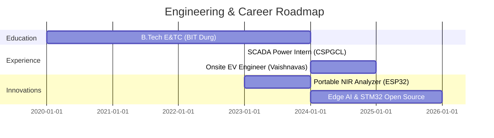

<!-- ========================================================================= -->
<!--                           HERO HEADER SECTION                             -->
<!-- ========================================================================= -->

<div align="center">

<!-- ⚠️ ACTION REQUIRED: Upload your own header banner to ./assets/Header%20banner.svg -->


<br/>

[](https://git.io/typing-svg)

<br/>

<!-- ⚠️ ACTION REQUIRED: Replace with your own hero GIF or remove this block -->
<p align="center">
  
  <br/>
  <sub><i>[ HERO ANIMATION PLACEHOLDER — Custom Hardware & Firmware Demo ]</i></sub>
</p>

<br/>

[](https://linkedin.com/in/krishnakantgarhe)
[](mailto:krishnakantgarhe@gmail.com)
[](https://github.com/Immanueal1)
[](./assets/resume.pdf)

</div>

<br/>

---

<!-- ========================================================================= -->
<!--                             ABOUT ME SECTION                              -->
<!-- ========================================================================= -->

## ⚡ About Me

```
┌─────────────────────────────────────────────────────────────────────────────┐
│ "I build real hardware. I write firmware. I work with AI.                  │
│  I design electronics. I create beautiful products."                       │
└─────────────────────────────────────────────────────────────────────────────┘
```

I am an **Electronics & Telecommunication Engineering graduate from BIT Durg** passionate about creating **intelligent physical systems**. My work bridges the gap between low-level silicon microcontrollers and high-level machine learning algorithms — engineering complete products from custom circuit schematics to deployable edge AI software.

- 🎓 **Electronics Engineer:** Deep background in circuit design, signal processing, and telecommunication systems.
- ⚡ **Embedded Systems & Firmware:** Architecting low-latency firmware in C/C++ for microcontrollers like ESP32, RP2040, and STM32.
- 🧠 **AI & Machine Learning:** Training lightweight ML models (SVM, Random Forest, CNNs) deployed directly on edge devices.
- 🔌 **PCB & Product Design:** Designing custom PCBs, analog front-ends (AFE), and sensor interfaces using KiCad & Proteus.
- 🔋 **Industry Experience:** Hands-on background in lithium-ion battery assembly, BMS wiring, and EV systems integration at **Vaishnavas Energy**, plus SCADA industrial telemetry at **CSPGCL**.

<br/>

---

<!-- ========================================================================= -->
<!--                          CURRENT FOCUS SECTION                            -->
<!-- ========================================================================= -->

## 🎯 Current Focus

<table width="100%">
  <tr>
    <td width="33%" align="center" valign="top">
      <br/>
      
      <br/><br/>
      <b>Building Edge AI Hardware</b>
      <p>Deploying real-time machine learning models directly onto resource-constrained MCU hardware.</p>
    </td>
    <td width="33%" align="center" valign="top">
      <br/>
      
      <br/><br/>
      <b>Low-Level Firmware</b>
      <p>Mastering FreeRTOS, memory optimization, DMA channels, and multi-core peripheral drivers.</p>
    </td>
    <td width="33%" align="center" valign="top">
      <br/>
      
      <br/><br/>
      <b>Custom Hardware Design</b>
      <p>Designing multi-layer PCBs, analog front-ends, power regulation, and BMS battery integration.</p>
    </td>
  </tr>
</table>

<br/>

---

<!-- ========================================================================= -->
<!--                            TECH STACK GRID                                -->
<!-- ========================================================================= -->

## 🛠️ Technical Skill Matrix

### 💻 Programming & Languages
<p>
  
  
  
  
  
  
  
</p>

### ⚡ Embedded Systems & Microcontrollers
<p>
  
  
  
  
  
</p>

### 📡 Protocols & Hardware Busses
<p>
  
  
  
  
</p>

### 🧠 AI, Machine Learning & Computer Vision
<p>
  
  
  
  
  
  
  
</p>

### 🔧 PCB Design & Hardware Test Equipment
<p>
  
  
  
  
  
  
  
</p>

### 🎨 Creative Software
<p>
  
  
  
  
</p>

### 🛠️ Development & IDE Tools
<p>
  
  
  
  
</p>

<br/>

---

<!-- ========================================================================= -->
<!--                           FEATURED PROJECTS                               -->
<!-- ========================================================================= -->

## 🚀 Featured Projects

<table width="100%">
  <tr>
    <td width="50%" valign="top">
      <h3>🔬 1. Portable NIR Microplastic Analyzer</h3>
      <p><b>Portable AI-powered environmental sensing device</b> using near-infrared (NIR) spectrometry to detect microplastic contamination directly in the field.</p>
      <ul>
        <li><b>Hardware:</b> ESP32 MCU, AS7263 Spectral Sensor, Custom Optical Chamber</li>
        <li><b>Edge Machine Learning:</b> SVM, Random Forest, & CNN model pipeline in Python</li>
        <li><b>Performance:</b> 95%+ classification accuracy across 5 distinct polymer types</li>
        <li><b>Interface:</b> Real-time IoT Dashboard & local OLED spectral feedback</li>
      </ul>
      <p align="center">
        <!-- ⚠️ ACTION REQUIRED: Upload image to ./assets/microplastic_analyzer.png -->
        
        <br/><sub><i>[ Real Prototype Hardware ]</i></sub>
      </p>
    </td>
    <td width="50%" valign="top">
      <h3>🌊 2. Raspberry Pi Pico Waveform Generator</h3>
      <p><b>High-speed arbitrary signal generator</b> capable of synthesizing custom analog waveforms up to 10MHz using RP2040 Programmable I/O (PIO).</p>
      <ul>
        <li><b>Core Engine:</b> Dual-core RP2040 + Direct Memory Access (DMA)</li>
        <li><b>DAC Topology:</b> Precision R-2R Resistor Network DAC</li>
        <li><b>Waveforms:</b> Sine, Square, Triangle, Sawtooth, & Custom Arbitrary LUTs</li>
        <li><b>User Interface:</b> LCD Display with dynamic frequency & amplitude control</li>
      </ul>
      <p align="center">
        <!-- ⚠️ ACTION REQUIRED: Upload image to ./assets/waveform_generator.png -->
        
        <br/><sub><i>[ Real Prototype Hardware ]</i></sub>
      </p>
    </td>
  </tr>
  <tr>
    <td width="50%" valign="top">
      <h3>📊 3. Portable Digital Oscilloscope</h3>
      <p><b>Compact signal acquisition & diagnostic tool</b> turning smartphone/PC displays into a high-performance lab oscilloscope using Scoppy firmware.</p>
      <ul>
        <li><b>Analog Front-End (AFE):</b> Custom input protection, attenuation, & AC/DC coupling</li>
        <li><b>Signal Analysis:</b> Real-time FFT spectrum analysis & voltage measurement</li>
        <li><b>Protocol Decoding:</b> On-the-fly UART, SPI, & I2C serial signal decoding</li>
        <li><b>Form Factor:</b> Handheld field diagnostic tool for hardware troubleshooting</li>
      </ul>
      <p align="center">
        <!-- ⚠️ ACTION REQUIRED: Upload image to ./assets/oscilloscope.png -->
        
        <br/><sub><i>[ Real Prototype Hardware ]</i></sub>
      </p>
    </td>
    <td width="50%" valign="top">
      <h3>💊 4. Smart IoT Medicine Dispenser</h3>
      <p><b>Automated healthcare appliance</b> dispensing scheduled medication doses with remote monitoring and alerts for caregiver compliance.</p>
      <ul>
        <li><b>Controller:</b> Arduino & ESP8266 Wi-Fi Module</li>
        <li><b>Mechanism:</b> Servo-driven carousel with multi-compartment locking</li>
        <li><b>Connectivity:</b> Blynk IoT Mobile Platform for real-time dosage logs & alarms</li>
        <li><b>Safety:</b> Optical feedback sensor verifying pill release execution</li>
      </ul>
      <p align="center">
        <!-- ⚠️ ACTION REQUIRED: Upload image to ./assets/medicine_dispenser.png -->
        
        <br/><sub><i>[ Real Prototype Hardware ]</i></sub>
      </p>
    </td>
  </tr>
</table>

<br/>

---

<!-- ========================================================================= -->
<!--                    RESEARCH & CERTIFICATIONS                             -->
<!-- ========================================================================= -->

## 🔬 Research & Certifications

<table width="100%">
  <tr>
    <td width="50%" valign="top">
      <h3>📑 Peer-Reviewed Research Publication</h3>
      <p><b>NIR-Based Portable Microplastic Analyzer using ESP32 & Edge ML</b></p>
      <p>Published in a Peer-Reviewed International Journal focusing on portable NIR spectrometry and polymer signature classification.</p>
      <br/>
      <p align="center">
        <!-- ⚠️ ACTION REQUIRED: Upload PDF to ./assets/publication_certificate.pdf -->
        <a href="./assets/publication_certificate.pdf" target="_blank"></a>
      </p>
    </td>
    <td width="50%" valign="top">
      <h3>📜 Technical Certifications</h3>
      <p>
        <!-- ⚠️ ACTION REQUIRED: Upload images to ./assets/ folder -->
        <a href="./assets/cpp_certificate_iit_bombay.png" target="_blank"></a>
        <br/><br/>
        <a href="./assets/c_certificate_iit_bombay.png" target="_blank"></a>
        <br/><br/>
        <a href="./assets/Python%20certificate.pdf" target="_blank"></a>
      </p>
    </td>
  </tr>
</table>

<br/>

---

<!-- ========================================================================= -->
<!--                         ENGINEERING TIMELINE                             -->
<!-- ========================================================================= -->

## 📈 Engineering Journey



<br/>

<details>
<summary>🔍 <b>Detailed Engineering Timeline (Click to expand)</b></summary>
<br/>

- 🎓 **2020 – 2024 | Electronics & Telecommunication Engineering (BIT Durg)**
  - Mastered foundational circuit theory, signal processing, digital communication, and microcontroller programming.
- ⚡ **2023 | SCADA Power Systems Intern (CSPGCL)**
  - Analyzed industrial telemetry, high-voltage substation automation, and grid parameter monitoring systems.
- 🔬 **2023 – 2024 | Flagship Innovation (NIR Microplastic Spectrometer)**
  - Engineered a portable field-deployable analyzer using ESP32 & machine learning models to classify microplastics with 95%+ accuracy.
- 🔋 **2024 – 2025 | Onsite Engineer Trainee (Vaishnavas Energy Pvt. Ltd.)**
  - Handled industrial lithium-ion battery pack assembly, BMS wiring harness, thermal safety, and EV power system integration.
- 🚀 **2025 – Present | Next-Gen Embedded AI & Open Source**
  - Expanding into STM32 bare-metal development, FreeRTOS, Embedded Linux, and TinyML hardware platforms.

</details>

<br/>

---

<!-- ========================================================================= -->
<!--                        ROADMAP / NOW BUILDING                             -->
<!-- ========================================================================= -->

## 🗺️ Now Building & Learning Roadmap

<table>
  <tr>
    <td width="50%">
      <h4>⚙️ Hardware & Firmware Skills</h4>
      <ul>
        <li>[x] ESP32 & RP2040 Advanced Firmware</li>
        <li>[x] Analog Front-End (AFE) Circuit Design</li>
        <li>[ ] <b>STM32 ARM Cortex-M</b> Bare-Metal & HAL</li>
        <li>[ ] <b>FreeRTOS</b> Multitasking & Synchronization</li>
        <li>[ ] <b>Embedded Linux</b> Buildroot & Yocto</li>
      </ul>
    </td>
    <td width="50%">
      <h4>🧠 Edge AI & Robotics</h4>
      <ul>
        <li>[x] Scikit-Learn / PyTorch ML Pipelines</li>
        <li>[x] ESP32 Edge Sensor Processing</li>
        <li>[ ] <b>TinyML</b> Quantized Neural Networks on MCUs</li>
        <li>[ ] <b>ROS / ROS2</b> Robotics Operating System</li>
        <li>[ ] Hardware Security & Secure Boot Loader</li>
      </ul>
    </td>
  </tr>
</table>

<br/>

---

<!-- ========================================================================= -->
<!--                         QUOTE SECTION CARD                                -->
<!-- ========================================================================= -->

## 💡 Engineering Philosophy

> *"The function of good engineering is to make complex physical reality behave with mathematical elegance."*
> <br/>
> — <b>Krishna Kant Garhe</b>

<br/>

---

<!-- ========================================================================= -->
<!--                      GITHUB STATS & ANALYTICS                             -->
<!-- ========================================================================= -->

## 📊 GitHub Analytics & Developer Metrics

<div align="center">

<!-- SIDE BY SIDE STATS CARDS -->


<br/><br/>

<!-- STREAK STATS CARD -->


<br/><br/>

<!-- SNAKE CONTRIBUTION GRAPH -->
<h3>🐍 GitHub Contribution Grid</h3>
<!-- ⚠️ ACTION REQUIRED: Set up GitHub Action to generate this SVG automatically -->

<br/>
<sub><i>(Automatically updated via GitHub Actions)</i></sub>

</div>

<br/>

### 🏆 GitHub Trophies
<div align="center">
  
</div>

<br/>

---

<!-- ========================================================================= -->
<!--                         OPEN SOURCE & CONTACT                             -->
<!-- ========================================================================= -->

## 🤝 Open Source & Collaboration

I am always excited to collaborate on **innovative hardware & AI projects**. 

- 🤝 **Looking for Collaborations in:** Embedded C/C++, Edge AI / TinyML, IoT Sensors, PCB Hardware Design, & Clean Energy Systems.
- 💬 **Ask me about:** ESP32, RP2040, Sensor Calibration, NIR Spectrometry, EV Battery Management, and ML on embedded data.
- 📬 **Reach out:** Open to full-time roles, freelance hardware prototyping, and open-source ventures PAN India.

<div align="center">

### 📩 Let's Connect

[](https://linkedin.com/in/krishnakantgarhe)
[](mailto:krishnakantgarhe@gmail.com)
[](https://github.com/Immanueal1)

</div>

<br/>

---

<!-- ========================================================================= -->
<!--                               FOOTER                                      -->
<!-- ========================================================================= -->

<div align="center">


<h3>⚡ Thanks for visiting! ⚡</h3>


</div>
