# 🏗️ Architecture Overview

This document describes the high-level system architecture across embedded hardware design, real-time C/C++ firmware, Edge AI sensor processing, and automated GitHub CI/CD profile rendering.

---

## 📐 System Block Diagram

```mermaid
graph TD
    subgraph Physical Hardware Layer
        A[Analog Transducers / NIR Spectral Sensor] --> B[Analog Front-End / AFE Signal Conditioning]
        B --> C[Microcontroller ADC / SPI / I2C Bus]
    end

    subgraph Real-Time Firmware Layer
        C --> D[ESP32 / RP2040 Low-Latency Drivers]
        D --> E[FreeRTOS Task Scheduler / Ring Buffer]
    end

    subgraph Edge Intelligence & Output
        E --> F[Scikit-Learn / TinyML Classifier Engine]
        F --> G[OLED Display / IoT Dashboard Telemetry]
    end

    style A fill:#171A30,stroke:#22D3EE,stroke-width:2px
    style D fill:#171A30,stroke:#8B5CF6,stroke-width:2px
    style F fill:#171A30,stroke:#EC4899,stroke-width:2px
    style G fill:#171A30,stroke:#22D3EE,stroke-width:2px
```

---

## 🔌 Layer Descriptions

### 1. Physical Hardware & Electronics Layer
- **Analog Front-End (AFE):** Op-amp active filtering (Sallen-Key topology), AC/DC coupling, and input overvoltage protection.
- **AS7263 NIR Spectrometer:** 6-channel near-infrared spectral channel sensing (610nm to 860nm wavelengths).
- **RP2040 PIO R-2R DAC:** Direct memory access (DMA) driving an 8-bit precision resistor ladder for zero-CPU waveform generation.

### 2. Embedded Firmware Layer
- **C/C++ HAL & Drivers:** Direct register access and hardware abstraction layer (HAL) for UART, SPI, I²C, and CAN Bus.
- **FreeRTOS Task Synchronization:** Mutex-protected queue management separating sensor acquisition tasks from display updates.

### 3. Edge AI Processing Layer
- **Feature Extraction:** Pre-processing raw spectral intensity data using vector normalization and derivative spectroscopy.
- **Machine Learning Models:** Lightweight SVM, Random Forest, and Quantized Neural Networks executing on-chip with 95%+ classification accuracy.

---

## 🎨 Visual Asset Architecture

All custom SVG graphics (`header-banner.svg`, `hero-system.svg`, `tech-stack.svg`, `experience-timeline.svg`, `github-metrics.svg`, `github-trophies.svg`) follow a unified **Dark Neon Dashboard Design System**:
- **Background Tokens:** Dark Navy (`#090A12`), Card Base (`#121426`, `#171A30`).
- **Accent Palette:** Vibrant Cyan (`#22D3EE`), Deep Violet (`#8B5CF6`), Neon Pink (`#EC4899`).
- **Typography:** `Inter`, `Fira Code` (monospace), system fallback fonts.
