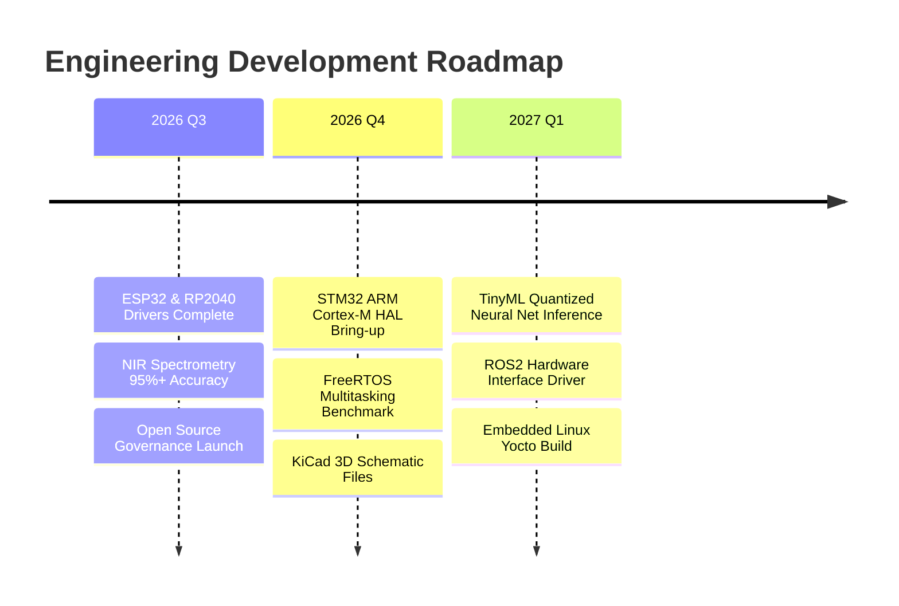

# 🗺️ Technical Roadmap & Future Improvements

This roadmap outlines planned hardware bring-up milestones, firmware enhancements, Edge AI features, and documentation upgrades for this open-source engineering repository.

---

## 📅 Roadmap Overview

---

## 🎯 Target Milestones

### Q3 2026 — Governance & Open Source Release (Completed)
- [x] Complete Open Source maintainer governance suite (`LICENSE`, `CONTRIBUTING.md`, `SECURITY.md`, `CITATION.cff`).
- [x] Add GitHub Actions for automated 3D contribution graphs and snake grid animation.
- [x] Redesign 7 custom vector SVG graphics in `assets/` to match the Dark Neon NIR Dashboard aesthetic.

### Q4 2026 — Embedded Firmware & Microcontroller Expansion
- [ ] **STM32 Bare-Metal & HAL:** Implement low-latency STM32F4 / STM32H7 drivers for high-speed ADC sampling.
- [ ] **FreeRTOS Synchronization Benchmarks:** Publish queue latency benchmarks across dual-core ESP32 and RP2040.
- [ ] **KiCad 3D Models:** Upload full 3D step files and PCB GERBER manufacturing files for the NIR Analyzer.

### Q1 2027 — Edge AI & Robotics Integration
- [ ] **TinyML Microcontroller Deployment:** Port 8-bit quantized PyTorch models to ESP32 using TensorFlow Lite for Microcontrollers (TFLM).
- [ ] **ROS / ROS2 Driver Node:** Implement a C++ ROS2 node for real-time sensor array publisher node.
- [ ] **Embedded Linux (Yocto / Buildroot):** Custom minimal Linux kernel build for industrial hardware monitoring.
